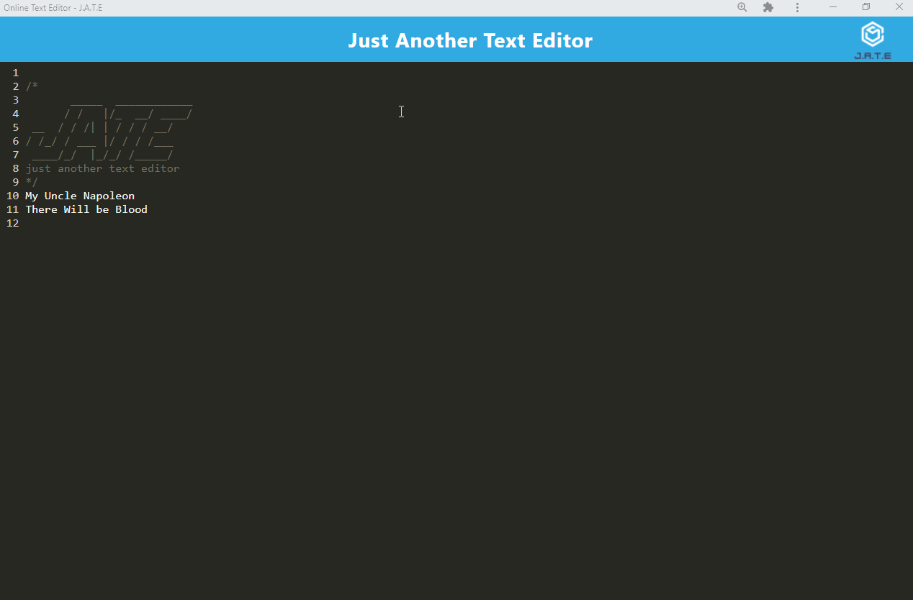

<div style="text-align:center"></a></div>

<h1>text-editor</h1>

<h2>Table of Content</h2>

- [Project Link](#project-link)
- [Getting Started](#getting-started)
- [Contributors](#contributor)
- [About The project](#about-the-project)

  - [User Flow](#user-flows)
  - [Technologies Used](#technologies-used)

### Project Link

- Please click [here](https://secure-scrubland-80892.herokuapp.com/) to see the deployed app in Heroku
- [here](https://github.com/Amir-Fard2025/text-editor) you have access to Github repo

### Getting Started

```
git clone
cd text-editor
code .
npm i
npm run start
in chrome open the localhost:3000
click install button
follow the prompt box
enjoy


```

### Contributor

- Amir : https://github.com/Amir-Fard2025

### About The Project

<p>This application uses PWA basics to make an offline one page application to make you able write daily texts edit them and permanently save them

#### User Flow

<p></p>

#### Technologies Used

<p>The following technologies are implemented in this project:</p>

-Javascript
-Express.js
-Webpack
-heroku
